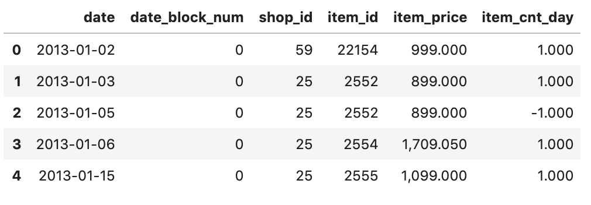
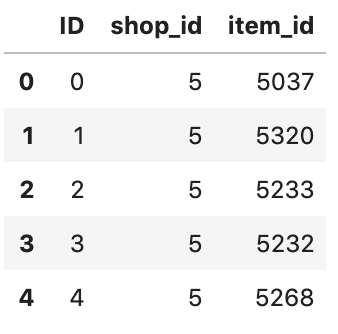
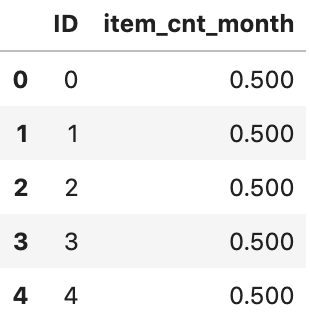
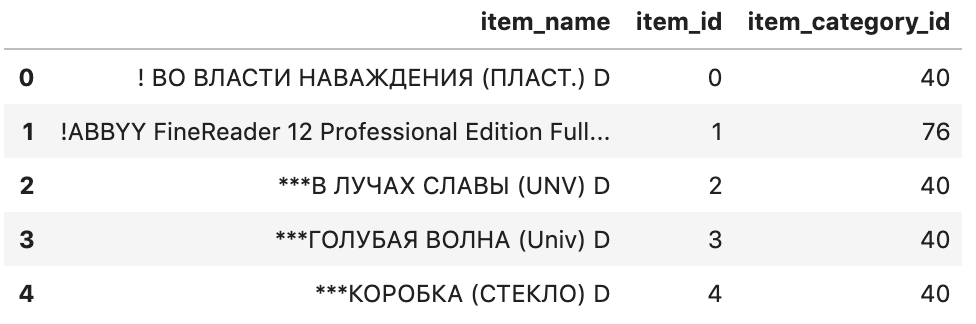
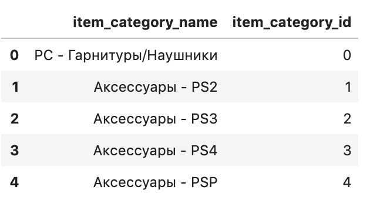
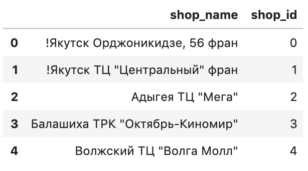

# Predict Future Sals - 미래의 매출 및 판매 예측

## 대회 소개 
러시아 소프트 회사 중 하나인 1C 회사에서 제공하는 일일 판매 데이터를 가지고, 다음 달의 모든 제품과 매장에 대한 총 매출을 예측해야합니다.

## [ 점수 평가 기준 ]
대회의 평가 방식은 __RMSE (Root Mean Squared Error)__ 입니다.
> __RMSE__ : 실제 정답과 예측한 값의 차이의 제곱을 평균한 값의 제곱근  

${\sqrt{ {1 \over N} \sum{(y_t - y_{pr})}^2}}$

## Data 구성
---

* __sales_train.csv__ : 2013년 1월부터 2015년 10월까지의 판매 기록 데이터를 가지는 학습데이터
* __test.csv__ : 2015년 11월 매출 데이터를 가지는 평가데이터
* __sample_submission.csv__ : 캐글제출양식
* __items.csv__ : item(제품)에 대한 추가 정보
* __item_categories.csv__ : item(제품) 카테고리에 대한 추가 정보
* __shops.csv__ : shops(가게)에 대한 추가 정보

### sales_train.csv

* __date__ : 말 그대로 날짜입니다. 하루 단위로 되어있습니다.
* __date_block_num__ : 월을 0부터 연속된 수로 변환한 수입니다. 예를들어, 13년 1월을 0으로 두고, 13년 12월은 11로, 그리고 14년 1월은 12로.. 이런식입니다.
* __shop_id__ : 말 그대로 shop의 id 입니다.
* __item_id__ : 말 그대로 item의 id 입니다.
* __item_price__ : 해당 날짜의 item_id 에 해당하는 item의 가격입니다.
* __item_cnt_day__ : 해당 날짜에 item_id 에 해당하는 item이 팔린 갯수입니다. 우리가 예측해야하는 변수이기도 합니다.

### test.csv

2015년의 11월의 각 shop 내 item들의 item_cnt_day 을 예측해야 한다고 했습니다. 이에 대한 기본 틀을 제공해주는 파일입니다. 
위 데이터로 테스트한 뒤, 최종적으로 아래와 같은 꼴로 바꾸어 제출해야 합니다.

### items.csv

* __item_name__ : 말 그대로 item 이름입니다. 데이터 제공회사가 러시아 회사이기 때문에 러시아어로 이루어져 있습니다.
* __item_category_id__ : 말 그대로 item 이 속해있는 카테고리 id 입니다.

### item_categories.csv

item_category_id의 이름을 담고있는 파일입니다.

### shops.csv

shop_id의 이름을 담고있는 파일입니다.

